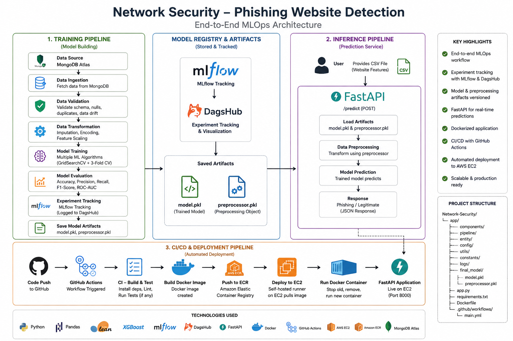
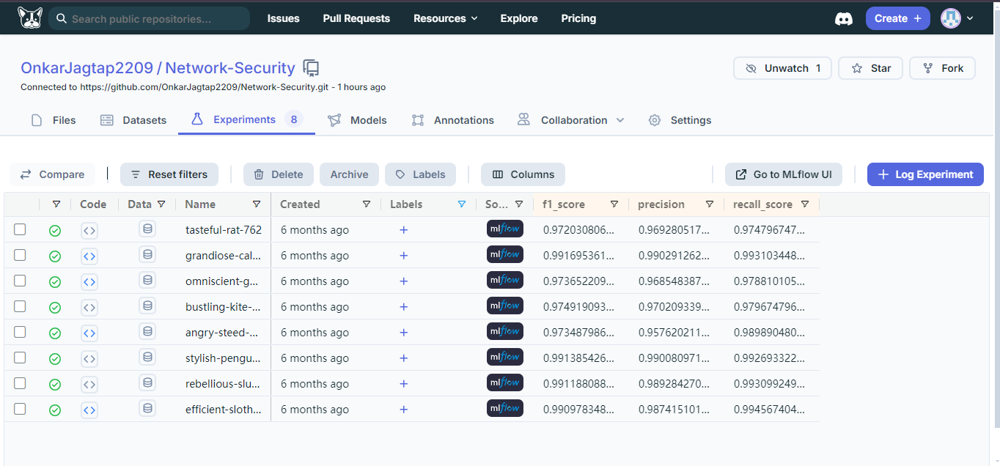
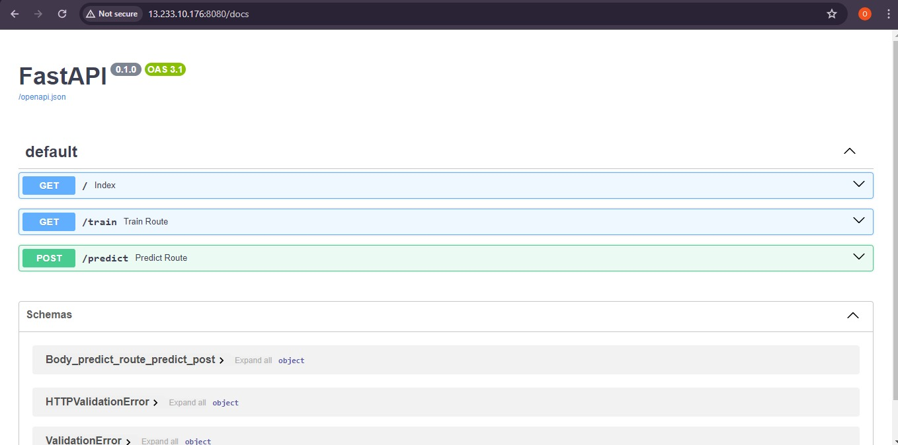
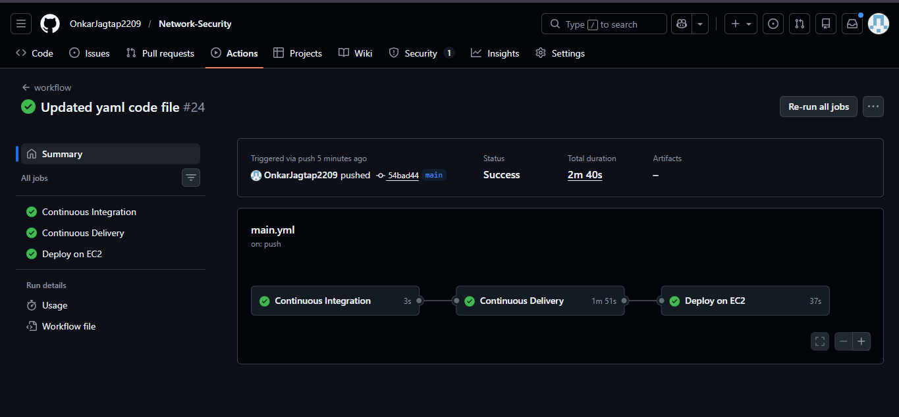
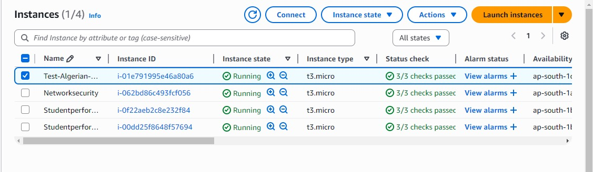

# End-to-End Phishing Website Detection System

An end-to-end machine learning system for detecting phishing websites from security-related website features, with data ingestion, validation, transformation, model training, experiment tracking, API serving, Docker containerization, CI/CD automation, and AWS deployment.

## Project Overview

Phishing websites are designed to imitate legitimate websites and can be used to steal sensitive information. This project uses supervised machine learning to classify website records into phishing/legitimate classes based on security-related features.

The project is implemented as an end-to-end ML pipeline rather than only a model-training notebook.

## 🏗️ Project Architecture

<p align="center">
  
</p>

### Key capabilities

- Data ingestion from MongoDB Atlas
- Data validation and schema checks
- Dataset drift detection
- Data transformation using a KNN imputer
- Training and comparison of multiple classification models
- Hyperparameter tuning with GridSearchCV
- Model evaluation using precision, recall, and F1-score
- MLflow experiment tracking with DagsHub
- Saved model and preprocessing artifacts
- FastAPI prediction service
- Docker containerization
- GitHub Actions CI/CD
- Docker image storage in Amazon ECR
- Deployment on Amazon EC2


## End-to-End Workflow

### 1. Data Ingestion

The training pipeline starts with `DataIngestion`.

The project connects to MongoDB Atlas, retrieves the dataset, converts the records into a Pandas DataFrame, removes the MongoDB `_id` field, stores the feature data, and creates train/test data artifacts.

### 2. Data Validation

The `DataValidation` component checks the ingested data against the project schema.

Validation includes:

- Expected number of columns
- Required/numerical columns
- Train/test data availability
- Dataset distribution drift using the Kolmogorov-Smirnov two-sample test

### 3. Data Transformation

The `DataTransformation` component separates features and target values and uses a Scikit-learn pipeline containing a `KNNImputer` to handle missing values.

The fitted preprocessing object is saved as:

```text
final_model/preprocessor.pkl
```

### 4. Model Training

The project evaluates multiple classification algorithms:

- Random Forest
- Decision Tree
- Gradient Boosting
- Logistic Regression
- AdaBoost

`GridSearchCV` is used for hyperparameter tuning with 3-fold cross-validation.

The trained model is saved as:

```text
final_model/model.pkl
```

### 5. Model Evaluation

The project logs:

- Precision
- Recall
- F1-score

to MLflow.

A visible historical DagsHub/MLflow experiment run recorded an F1-score of  **99.17%**, with  **99.03% precision** and **99.31% recall**. These values are shown in the project's experiment tracking results.

>
---

## Experiment Tracking

MLflow is used for experiment tracking, and DagsHub provides the remote experiment interface.

The project tracks classification metrics including:

```text
precision
recall_score
f1_score
```

This makes it possible to compare historical experiment runs and inspect logged models/artifacts.

### Experiment Results Screenshot



---

## API

The project uses FastAPI to serve the trained model.

The application exposes:

| Method | Endpoint | Purpose |
|---|---|---|
| GET | `/` | Redirects to Swagger API documentation |
| GET | `/train` | Indicates that training is disabled in production |
| POST | `/predict` | Accepts a CSV file and returns predictions |

## API Screenshot



---

## CI/CD Pipeline

GitHub Actions is used to automate the deployment workflow.

The current workflow contains three jobs:

### Continuous Integration

- Checkout repository
- Run the configured linting step
- Run the configured unit-test step

### Continuous Delivery

- Configure AWS credentials
- Login to Amazon ECR
- Build Docker image
- Tag the image as `latest`
- Push the image to ECR

### Continuous Deployment

- Runs on a self-hosted runner
- Pulls the latest image from ECR
- Stops/removes the previous `networksecurity` container
- Starts the new container
- Exposes port `8080`
- Cleans unused Docker images

```text
Git Push to main
       │
       ▼
GitHub Actions
       │
       ├── Continuous Integration
       │
       ├── Continuous Delivery
       │       └── Docker → Amazon ECR
       │
       └── Deploy on EC2
               └── Pull image → Run container
```

## CI/CD Screenshot



---

## AWS Deployment

The application is containerized using Docker and deployed on Amazon EC2.

The deployment flow is:

```text
Source Code
    ↓
Docker Image
    ↓
Amazon ECR
    ↓
Amazon EC2
    ↓
Docker Container
    ↓
FastAPI
```

The GitHub Actions deployment workflow pulls the latest image from ECR and runs the container on the EC2 self-hosted runner.

## EC2 Screenshot



---


## Project Structure

```text
Network-Security/
│
├── .github/
│   └── workflows/
│       └── main.yml
│
├── Network_Data/
├── data_schema/
│
├── networksecurity/
│   ├── cloud/
│   ├── components/
│   ├── configuration/
│   ├── entity/
│   ├── exception/
│   ├── logging/
│   ├── pipeline/
│   └── utils/
│
├── templates/
│
├── app.py
├── main.py
├── push_data.py
├── Dockerfile
├── requirements.txt
├── setup.py
└── README.md
```

---

## Technology Stack

| Category | Technology |
|---|---|
| Programming Language | Python |
| Data Processing | Pandas, NumPy |
| Machine Learning | Scikit-learn |
| Database | MongoDB Atlas |
| API | FastAPI |
| Experiment Tracking | MLflow |
| ML Experiment Platform | DagsHub |
| Containerization | Docker |
| Version Control | Git, GitHub |
| CI/CD | GitHub Actions |
| Container Registry | Amazon ECR |
| Cloud Compute | Amazon EC2 |
| Cloud Storage / Artifacts | Amazon S3 |

## Results

The project's MLflow/DagsHub experiment tracking contains multiple historical runs.

One visible run recorded:

| Metric | Value |
|---|---:|
| Precision | ~99.03% |
| Recall | ~99.31% |
| F1-score | ~99.17% |

The repository evaluates five classification algorithms and uses MLflow to record the classification metrics.

---

## Important Notes

- The deployed prediction API uses the saved `preprocessor.pkl` and `model.pkl` artifacts.
- Training is separated from production prediction; the `/train` endpoint explicitly reports that training is disabled in production.
- The current GitHub Actions workflow is triggered by pushes to the `main` branch, except changes that only modify `README.md`.
- AWS credentials are passed through GitHub repository secrets and should never be committed to source control.
- The screenshots in this README are project/deployment evidence and are stored under `assets/`.

---

## Project Repository

[GitHub Repository](https://github.com/OnkarJagtap2209/Network-Security)

---

## Author

**Onkar Nandu Jagtap**

Machine Learning | MLOps | FastAPI | Docker | AWS

---

## License

This project is intended for educational and portfolio purposes.


